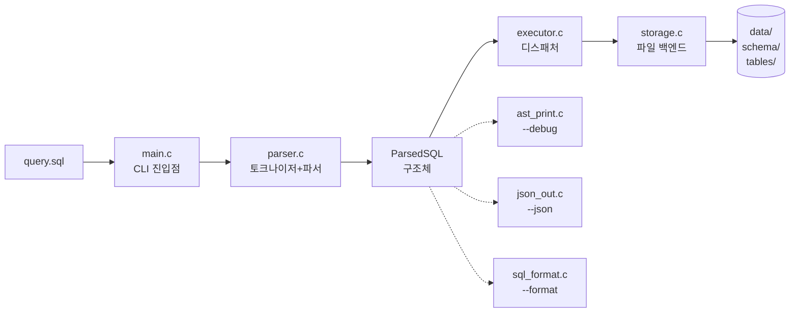
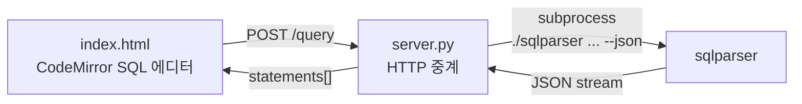
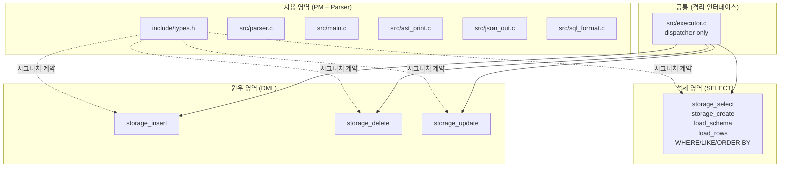

# MiniSQL — 파일 기반 SQL 처리기

> **정글 6주차 1일 프로젝트** · C 로 만든 미니 DBMS
> CREATE / INSERT / SELECT / UPDATE / DELETE 를 직접 파싱·실행하고,
> Python 서버 + HTML 뷰어까지 한 번에 묶었다.

[]() []() []() []()

---

## ⚡ 한 줄 데모

```bash
./run_demo.sh
```

빌드 → 단위 테스트 → CLI 시연 → HTTP 서버 시작 → 브라우저 안내까지 한 방에.

---

## 📦 빠른 시작

```bash
make                     # 빌드
make test                # 201 단위 테스트
./sqlparser query.sql    # CLI 실행
python3 server.py        # 브라우저 뷰어 (http://localhost:8000)
```

---

## 🎯 지원 SQL

| 구문 | 예시 |
|---|---|
| `CREATE TABLE` | `CREATE TABLE users (id INT, name VARCHAR, joined DATE);` |
| `INSERT` | `INSERT INTO users (id, name) VALUES (1, 'alice');` |
| `SELECT` | `SELECT id, name FROM users WHERE age > 20 ORDER BY name DESC LIMIT 5;` |
| `UPDATE` | `UPDATE users SET age = 26 WHERE id = 1;` |
| `DELETE` | `DELETE FROM users WHERE id = 2;` |
| 집계 | `SELECT COUNT(*) FROM users;` |
| 패턴 | `SELECT * FROM users WHERE name LIKE 'A%';` |
| 라인 주석 | `-- 이건 무시됨` |

**컬럼 타입 6종:** `INT`, `VARCHAR`, `FLOAT`, `BOOLEAN`, `DATE` (`'YYYY-MM-DD'`), `DATETIME`

**WHERE 연산자:** `=`, `!=`, `>`, `<`, `>=`, `<=`, `LIKE` (`%`, `_`)
1~2 조건 + `AND` / `OR` 결합 지원.

---

## 🛠 CLI 플래그

| 플래그 | 동작 |
|---|---|
| (없음) | 파싱 → 실행 |
| `--debug` | AST 트리 출력 |
| `--json` | ParsedSQL JSON 직렬화 |
| `--tokens` | 토크나이저 출력만 |
| `--format` | ParsedSQL → 정규화 SQL 재출력 (round-trip) |
| `--help`, `-h` | 사용법 |
| `--version` | 버전 |

`--debug`, `--json`, `--format` 동시 사용 가능.

---

## 🏗 아키텍처

### 데이터 흐름



### 브라우저 데모 경로



### 부품별 책임

| 파일 | 책임 |
|---|---|
| `src/parser.c` | 토크나이저 + 재귀 하강 파서 → `ParsedSQL*` 반환 |
| `src/executor.c` | `ParsedSQL` 디스패처. 쿼리 종류별 storage 호출 |
| `src/storage.c` | 파일 기반 백엔드 (CSV + .schema 텍스트) |
| `src/ast_print.c` | `--debug` AST 트리 시각화 |
| `src/json_out.c` | `--json` JSON 직렬화 |
| `src/sql_format.c` | `--format` 정규화 SQL 재직렬화 |
| `src/main.c` | CLI 진입점, 옵션 처리, 세미콜론 split, JSON 격리 |
| `include/types.h` | `ParsedSQL`, `ColumnType`, 모든 함수 선언 (인터페이스 계약) |
| `server.py` | Python stdlib HTTP 중계 (의존성 0) |
| `index.html` | 단일 페이지 SQL 뷰어, CodeMirror 신택스 하이라이트, Cards/JSON 토글 |

### 인터페이스 계약 (storage.c)

`include/types.h` 의 `storage_*` 함수 시그니처는 **절대 변경 금지**.
호출부 (`executor.c`) 는 storage 의 내부 구조를 알면 안 된다 (캡슐화).
2주차에 내부를 B+트리/해시 인덱스로 교체해도 호출부는 영향받지 않는 설계.

---

## 📁 디렉토리 구조

```
sql_parser/
├── include/
│   └── types.h              ─── 모든 자료구조 + 함수 선언 (인터페이스)
├── src/
│   ├── main.c               ─── CLI 진입점, --json/--debug/--tokens/--format
│   ├── parser.c             ─── 토크나이저 + 파서 (지용)
│   ├── ast_print.c          ─── --debug 트리 (지용)
│   ├── json_out.c           ─── --json 직렬화 (지용)
│   ├── sql_format.c         ─── --format 재직렬화 (지용)
│   ├── executor.c           ─── ParsedSQL 디스패처
│   └── storage.c            ─── 파일 기반 백엔드 (석제 SELECT/CREATE + 원우 INSERT/DELETE/UPDATE)
├── tests/
│   ├── test_parser.c        ─── 150 단위 테스트 (parser/AST/JSON/format)
│   ├── test_executor.c      ─── 3 executor 통합 테스트
│   ├── test_storage_insert.c ── 10 INSERT 단위 테스트
│   ├── test_storage_delete.c ── 18 DELETE 단위 테스트
│   └── test_storage_update.c ── 20 UPDATE 단위 테스트
├── data/                    ─── (gitignored) 런타임 schema/, tables/
├── docs/
│   ├── QA_CHECKLIST.md      ─── 60+ 수동 회귀 케이스
│   └── QA_REPORT_AUTO.md    ─── 자동 검증 보고서
├── server.py                ─── Python HTTP 중계 서버
├── index.html               ─── 다크 테마 + CodeMirror 뷰어
├── query.sql                ─── 발표 데모 시나리오
├── run_demo.sh              ─── 빌드+테스트+CLI+서버 부트스트랩
├── .github/
│   ├── workflows/build.yml  ─── CI: build + test + valgrind
│   └── pull_request_template.md
├── Makefile
├── CLAUDE.md / agent.md     ─── PM 컨텍스트 / 팀원 가이드
└── README.md
```

---

## ✅ 품질 지표

| 항목 | 값 |
|---|---|
| 단위 테스트 | **201 passed / 0 failed** |
| 빌드 경고 | **0** (`-Wall -Wextra -Wpedantic`) |
| Valgrind 누수 | **0** (sqlparser, test_runner, test_storage_*) |
| GitHub Actions CI | ✅ 모든 push/PR 자동 검증 |
| 자동 QA 케이스 | **47 / 47 통과** ([QA_REPORT_AUTO.md](docs/QA_REPORT_AUTO.md)) |

### 테스트 커버리지

- 5 종 쿼리 (CREATE/INSERT/SELECT/DELETE/UPDATE)
- 6 종 ColumnType (INT/VARCHAR/FLOAT/BOOLEAN/DATE/DATETIME)
- WHERE 6 연산자 + AND/OR + LIKE 패턴 (`%`, `_`)
- ORDER BY ASC/DESC, LIMIT (0, 음수, 초과 모두)
- COUNT(*), 빈 결과, 빈 테이블, 1000건 처리
- AST/JSON/format 출력 round-trip 검증
- 토크나이저 엣지 (음수, float, 따옴표, DATE, 빈 따옴표, 라인 주석)

---

# 🤝 협업 모델

이 1주차 결과물은 4명이 **각자 영역을 격리한 상태에서 병렬 개발** 하고,
**GitHub Actions CI 가 모든 PR 을 자동 검증**, PM 이 코드 리뷰 후 머지하는 워크플로로 만들어졌다.

## GitHub Actions CI

`.github/workflows/build.yml` 가 모든 push/PR 에 자동으로:

```yaml
- gcc/make/valgrind 설치
- make CFLAGS="-Werror"           # 경고도 빌드 실패 처리
- make test                        # 201 단위 테스트
- valgrind --leak-check=full ./test_runner
- valgrind --leak-check=full ./sqlparser query.sql
```

→ PR 페이지에 빨간/초록 자동 표시. **MP2 의 B vs C 경쟁 평가 객관화** 에 결정적이었다.

## 병렬 개발 — 영역 격리



**핵심 원칙:**
- `include/types.h` 의 `storage_*` 시그니처는 **절대 변경 금지** → 인터페이스 계약
- 각자 자기 함수 본문만 채움 → 동시 작업 시 머지 충돌 최소화
- `executor.c` 는 dispatcher 만 — 어느 한 명이 망쳐도 다른 사람은 작업 가능

## 머지 워크플로

```
feature/<본인>  →  PR + CI green  →  PM 리뷰  →  dev  →  PR  →  main
```

- **`main` / `dev`** 는 브랜치 보호 (직접 push 차단, admin 만 우회)
- 모든 PR 은 `.github/pull_request_template.md` 양식 자동 적용
- B vs C 경쟁 평가는 동일 양식 → 객관 비교

## B vs C 경쟁 평가 (실제 사례)

INSERT/DELETE/UPDATE 구현은 두 명이 경쟁:

| 기준 | B (원우) | C (세인) |
|---|---|---|
| 빌드 무경고 | ✅ | ✅ |
| 단위 테스트 수 | **48 개** | 0 개 |
| INSERT/DELETE/UPDATE 구현 | ✅ 실구현 | stub |
| NULL/에러 가드 | 145 곳 | — |
| 인터페이스 계약 준수 | ✅ | — |

→ **B (원우) 채택**. 4-0 압승. 객관 데이터 기반 결정.

## 1주차 합산

| 항목 | 값 |
|---|---|
| Pull Request 수 | 24 |
| 머지된 commit | 60+ |
| C 소스 라인 | 약 5000 |
| 단위 테스트 | 201 |
| CI 실행 시간 | 평균 25초 |
| 충돌 발생 머지 | 1건 (PR #20 → #23 재작업) |
| 작업 손실 사고 | 1건 (PR #21, 학습 사례) |

---

## 🎬 발표 데모 흐름

```bash
./run_demo.sh
```

1. `make` 빌드 (무경고)
2. `make test` — 201 통과
3. `./sqlparser query.sql --debug` — AST 트리 + 실행 결과
4. `python3 server.py` — 브라우저에서 `http://localhost:8000`

### 시연 SQL (`query.sql`)

```sql
CREATE TABLE users (id INT, name VARCHAR, age INT, joined DATE);

INSERT INTO users (id, name, age, joined) VALUES (1, 'alice', 25, '2024-01-15');
INSERT INTO users (id, name, age, joined) VALUES (2, 'bob',   31, '2024-03-02');
INSERT INTO users (id, name, age, joined) VALUES (3, 'carol', 28, '2024-06-20');

SELECT * FROM users;

SELECT id, name FROM users WHERE age > 26 ORDER BY age DESC LIMIT 2;

UPDATE users SET age = 26 WHERE name = 'alice';

DELETE FROM users WHERE id = 2;

SELECT * FROM users;

SELECT COUNT(*) FROM users;
```

### 브라우저 뷰어 기능

- **CodeMirror SQL 에디터** — 신택스 하이라이트, 줄 번호, `Ctrl+Enter` 실행
- **Cards / JSON 토글** — 결과를 statement 별 카드 또는 통합 JSON 으로
- **다크 테마 (Dracula)**
- **stderr 분리 표시** — 에러 메시지는 별도 영역
